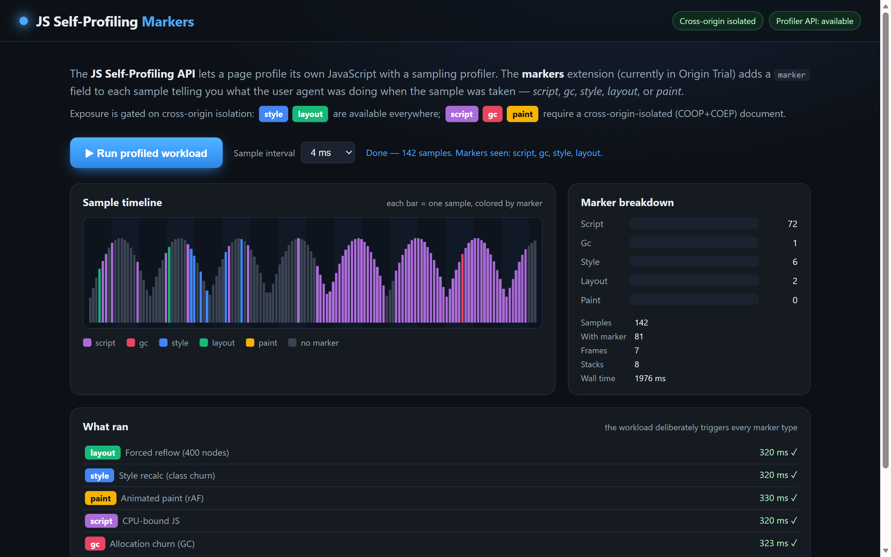

# JS Self-Profiling Markers — Live Demo

> **Based on the original demo by [Victor Huang](https://github.com/victorhuangwq)** —
> see [victorhuangwq/js-profiler-markers-demo](https://github.com/victorhuangwq/js-profiler-markers-demo).
> See also Datadog's non-isolated-context fork by
> [Thomas Bertet](https://github.com/thomasbertet) at
> [thomasbertet/js-profiler-markers-demo](https://github.com/thomasbertet/js-profiler-markers-demo).

A small, self-contained demo of the **markers extension** to the
[JS Self-Profiling API](https://wicg.github.io/js-self-profiling/), which is now
in **Origin Trial** in Chromium (Microsoft Edge and Google Chrome, **M153–M161**).

The API lets a page sample its own JavaScript call stacks from script. The
markers extension adds a `marker` field to each sample that tells you **what the
engine was doing** when the sample was taken — running your script, or busy in
one of the engine's own phases: **style, layout, paint, or garbage collection**.
That turns a flat stack sampler into something you can use to attribute time to
engine work your JS triggered but never appears in a JS stack.

> Works identically in **Edge** and **Chrome** — they share the same Blink/V8
> engine. This demo is engine-level, not browser-specific.



*Edge, cross-origin-isolated route. The timeline colors each sample by its
marker; the breakdown shows how the same workload splits across engine phases.*

---

## The five markers

| Marker   | Meaning                                              |
| -------- | ---------------------------------------------------- |
| `script` | Executing page JavaScript                            |
| `gc`     | V8 garbage collection                                |
| `style`  | Style resolution                                     |
| `layout` | Layout / reflow                                      |
| `paint`  | Paint                                                |

A sample with no marker is ordinary JS execution with no active engine phase.

## Cross-origin isolation gates the markers

This is the security-relevant part, and the demo shows it directly by serving
the **same app at two routes**:

| Route      | Context                    | Markers exposed                          |
| ---------- | -------------------------- | ---------------------------------------- |
| `/no-coi`  | not cross-origin isolated  | `style`, `layout` only                   |
| `/coi`     | cross-origin isolated (COOP+COEP) | all five: `script`, `gc`, `style`, `layout`, `paint` |

In a non-isolated document the engine returns **only** `style` and `layout`;
`script`, `gc`, and `paint` markers are **dropped entirely** (not coarsened).
The richer markers require the stronger isolation guarantee that
cross-origin isolation provides. You can see this live: run the demo on both
routes and compare the breakdown.

## Run it

```bash
npm start            # static server on http://localhost:8123 (no dependencies)
```

Then open, in **Edge or Chrome**:

- <http://localhost:8123/coi> — cross-origin isolated, all five markers
- <http://localhost:8123/no-coi> — not isolated, only style + layout

Click **Run profile** and watch the timeline fill in.

### Do I need a flag or a token?

- **On a browser in the trial window (M153–M161), served from localhost:** no.
  `localhost` is exempt from Origin-Trial tokens, and the only response header
  the API needs is `Document-Policy: js-profiling` (the server sets it for you).
- **On a deployed origin:** register for the
  [Origin Trial](https://developer.chrome.com/origintrials/) and add the token
  via a `<meta http-equiv="origin-trial">` tag or an `Origin-Trial` header. No
  browser flag is needed for real users.

## How it works

- [`public/workloads.js`](public/workloads.js) — five small workloads, each
  designed to make the engine spend time in one phase (forced reflow for
  `layout`, restyle for `style`, canvas/rAF for `paint`, tight compute for
  `script`, allocation churn for `gc`).
- [`public/demo.js`](public/demo.js) — constructs a `Profiler`, runs the
  workloads, reads back `trace.samples`, and buckets them by `marker` to draw
  the timeline and breakdown.
- [`scripts/server.cjs`](scripts/server.cjs) — sets `Document-Policy:
  js-profiling` on every response and adds COOP+COEP on `/coi`.

## Background & specs

- Explainer & spec: <https://github.com/WICG/js-self-profiling>
- Markers extension discussion (COI gating provenance):
  [WICG/js-self-profiling#61](https://github.com/WICG/js-self-profiling/issues/61)
- Lazy profiling mode (`js-profiling-mode`):
  [WICG/js-self-profiling#87](https://github.com/WICG/js-self-profiling/pull/87)

## License

[MIT](LICENSE)
